# DOKUMEN SPESIFIKASI UI/UX & SISTEM DESAIN PRODUK
# HUNIKU: Dedicated Housing Portal & Smart Estate Management Ecosystem (Web Version)

---

**Penulis:** Senior UI/UX & Lead Product Designer (10+ Years Experience)  
**Versi Dokumen:** 3.0 (Fresha/Airbnb-Inspired Web Architecture Edition)  
**Tanggal Rilis:** Oktober 2026  
**Status Dokumen:** Siap Serah-Terima (*Ready for Developer Handoff & Stakeholder Evaluation*)  
**Target Platform:** Modern Responsive Web App (Desktop, Tablet, & Mobile)  
**Live Prototype URL:** [https://keyion2478.github.io/Prototype-huniku-web/](https://keyion2478.github.io/Prototype-huniku-web/)  
**GitHub Repository:** [https://github.com/Keyion2478/Prototype-huniku-web](https://github.com/Keyion2478/Prototype-huniku-web)  

---

## DAFTAR ISI
1. [Ringkasan Proyek](#1-ringkasan-proyek)
2. [Riset Pengguna (User Research & Personas)](#2-riset-pengguna)
3. [User Journey Map](#3-user-journey-map)
4. [User Flow (Alur Pengguna & Diagram Mermaid)](#4-user-flow)
5. [Information Architecture (Sitemap & Navigasi Web)](#5-information-architecture)
6. [Daftar Fitur & Prioritas (MoSCoW Matrix)](#6-daftar-fitur--prioritas)
7. [Wireframe & Mockup Visual Antarmuka (Versi Website)](#7-wireframe--mockup-visual-antarmuka-versi-website)
   - 7.1. Hero Section & Modern Floating Search Pod (Fresha Style)
   - 7.2. Marketplace Catalog & Grid Kartu Properti Responsif
   - 7.3. Modal Detail Unit & Spesifikasi Arsitektural Lengkap
   - 7.4. Digital Booking Pass (Anti-Double Booking) & QR Verification
   - 7.5. Masterplan Kawasan 2D & Inspector Denah Interaktif
   - 7.6. Kalkulator Simulasi KPR Perbankan & Checklist Berkas
   - 7.7. Portal Layanan Warga (Huniku Resident) & Tracker Garansi 180 Hari
   - 7.8. Konsol Master Pengembang (Developer & Admin Console)
8. [Design System & UI Tokens](#8-design-system--ui-tokens)
   - 8.1. Color Palette & Token Peran (Tag Warna 60:30:10)
   - 8.2. Skala Tipografi (Plus Jakarta Sans & JetBrains Mono)
   - 8.3. Spacing & Grid System (8-Point Layout)
   - 8.4. Komponen UI & Status Interaksi (States Matrix)
9. [Interaksi & Mikro-Animasi (Micro-Interactions)](#9-interaksi--mikro-animasi)
10. [Edge Cases & Error Handling](#10-edge-cases--error-handling)
11. [Aksesibilitas (WCAG 2.1 Compliance)](#11-aksesibilitas-wcag-21-compliance)
12. [Perilaku Responsif (Responsive Breakpoints)](#12-perilaku-responsif)
13. [Catatan Handoff Developer & Struktur Berkas](#13-catatan-handoff-developer)
14. [Rencana Usability Testing (Protokol Evaluasi PjBL)](#14-rencana-usability-testing)

---

## 1. RINGKASAN PROYEK

### 1.1. Konteks & Definisi Produk
- **Nama Produk:** Huniku (Versi Website)
- **Jenis Produk:** Digital Real Estate Marketplace & Smart Estate Management Ecosystem.
- **Deskripsi Singkat:** Platform web terpadu untuk kawasan perumahan lokal (pilot project di Bandar Lampung: *Grand Alessandra Residence*, *Sentral Garden Residence*, dan *Villa Permata Indah*) yang dirancang mengadopsi standar marketplace modern kelas dunia (seperti Fresha dan Airbnb). Platform ini menghadirkan transparansi stok kavling *real-time* bebas *double booking*, simulator kelayakan KPR anuitas perbankan, masterplan interaktif 2D, portal purna-jual warga dengan garansi retensi 180 hari, serta konsol manajemen pengembang.

### 1.2. Masalah Utama yang Diselesaikan (Core Pain Points)
1. **Risiko Pemesanan Ganda (Double Booking):** Pembeli sering kali memilih kavling yang secara offline telah dibooking orang lain akibat pencatatan manual atau selisih waktu sinkronisasi antarsales.
2. **Pengalaman Pengguna Kaku (*Dated OS Dropdown*):** Dropdown pencarian konvensional bawaan browser memotong teks dan memberikan impresi produk usang. Huniku Web menyelesaikan ini melalui *custom floating popover* berlekuk halus dengan subteks informatif.
3. **Asimetri Informasi & Kebingungan Berkas KPR:** Pembeli rumah pertama (*first-time buyers*) mengalami kebingungan membedakan skema suku bunga bank (BTN Syariah, Mandiri, BCA), perhitungan DP, dan kelengkapan dokumen.
4. **Layanan Pasca-Huni Tercecer:** Laporan kerusakan fisik rumah (atap bocor, retak dinding, instalasi air) pasca serah terima kunci sering hilang di grup chat WhatsApp tanpa kepastian status garansi retensi gratis dari developer.

### 1.3. Metrik Keberhasilan (Success Metrics)
- **Zero Double-Booking Incident (0%):** Validasi integritas penguncian unit atomik saat pengujian transaksi simultan.
- **Task Success Rate > 92%:** Calon pembeli berhasil memfilter kawasan, memilih unit, dan menerbitkan Booking Pass dalam waktu < 2.5 menit.
- **System Usability Scale (SUS) Score > 82.5:** Tingkat penerimaan kepuasan pengguna di atas ambang batas *Grade A (Excellent)*.
- **Pemuatan Halaman Super Ringan (< 1.2 detik):** Dibangun dengan HTML5 semantik, CSS murni, dan Vanilla JS tanpa runtime framework berat.

---

## 2. RISET PENGGUNA

### 2.1. Segmentasi Pengguna
1. **Calon Pembeli Rumah (First-Time Buyer & Investor):** Mengutamakan kepastian hukum kavling, kejelasan biaya, dan transparansi simulasi KPR.
2. **Warga Penghuni (Homeowners):** Mengutamakan kemudahan pelaporan komplain purna-jual bergaransi dan keteraturan iuran lingkungan (IPL).
3. **Pengembang / Developer (Marketing & Maintenance Lead):** Membutuhkan konsolidasi status unit satu pintu dan pelacakan surat tugas teknisi.

### 2.2. User Personas

#### Persona 1: Calon Pembeli Rumah Pertama (KPR)
- **Nama:** Rizky Pratama (29 Tahun)
- **Profesi:** Karyawan Swasta (Industri Logistik, Bandar Lampung)
- **Perangkat Utama:** Laptop & Ponsel Pintar
- **Goals:** Mendapatkan rumah tipe 36 atau 45 di Sukarame/Natar dengan cicilan terukur (Rp 2–3 juta/bulan) dan kavling pasti terkunci tanpa takut diserobot.
- **Pain Points:** Menghabiskan waktu survei fisik ke kantor pemasaran hanya untuk mengetahui unit idaman sudah ter-booking.

#### Persona 2: Warga Penghuni Baru (Homeowner)
- **Nama:** Ibu Ratna (34 Tahun)
- **Profesi:** Wiraswasta / Ibu Rumah Tangga (Penghuni Blok B-05 Sentral Garden)
- **Goals:** Memperbaiki instalasi pipa air yang rembes dalam masa garansi retensi developer tanpa dikenakan biaya tambahan.
- **Pain Points:** Komplain di WhatsApp perumahan sering tertimbun obrolan lain dan tidak ada bukti tertulis masa garansi.

---

## 3. USER JOURNEY MAP

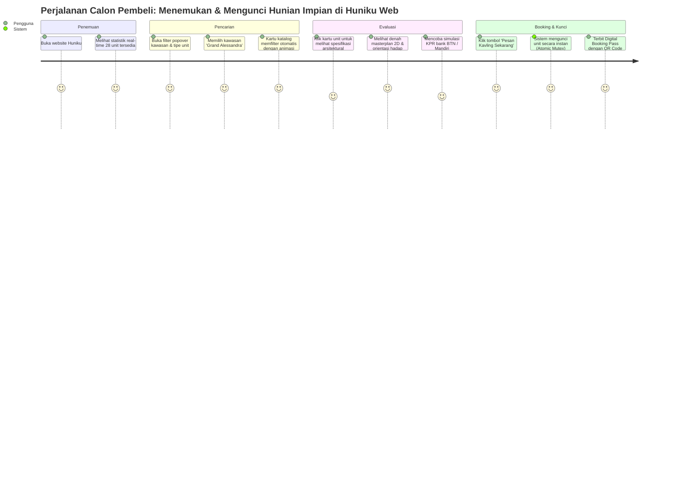

---

## 4. USER FLOW

### 4.1. Alur Transaksi Pemesanan Kavling (Anti-Double Booking)
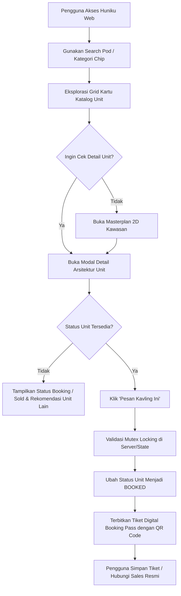

---

## 5. INFORMATION ARCHITECTURE

### 5.1. Struktur Navigasi Web Huniku (Sitemap)
```mermaid
graph TD
    Root[HUNIKU WEB APPLICATION] --> Nav[Sticky Top Navigation Bar]
    
    Nav --> View1[1. Katalog Kavling]
    View1 --> HeroPod[1.1 Hero & 3-Segment Floating Search Pod]
    View1 --> Popovers[1.1.1 Custom Popovers: Kawasan, Tipe, Anggaran]
    View1 --> Chips[1.2 Quick Filter Chips: Tipe 36, 45, 54]
    View1 --> Grid[1.3 Responsive Property Cards Grid]
    View1 --> Modals1[1.4 Modal Unit Detail & Specs]
    View1 --> Modals2[1.5 Modal Digital Booking Pass]

    Nav --> View2[2. Masterplan 2D]
    View2 --> Canvas2D[2.1 Visual Masterplan Map & Cluster Nodes]
    View2 --> Inspector[2.2 Unit Inspector Sidebar & Compass Orientation]

    Nav --> View3[3. Simulasi KPR]
    View3 --> BankSelect[3.1 Selector Bank Rekanan: BTN, Mandiri, BCA]
    View3 --> Calculator[3.2 Slider DP, Tenor 5-25 Tahun, Plafon Kredit]
    View3 --> Checklist[3.3 Checklist Dokumen Syarat KPR]

    Nav --> View4[4. Portal Warga]
    View4 --> ResidentCard[4.1 Info Kavling Terverifikasi & IPL Status]
    View4 --> WarrantyCard[4.2 Tracker Garansi Retensi 180 Hari]
    View4 --> ComplaintForm[4.3 Form Aduan Kerusakan Berfoto]

    Nav --> View5[5. Konsol Pengembang]
    View5 --> SalesMetric[5.1 Ringkasan Omset & Status Inventaris]
    View5 --> UnitTable[5.2 Tabel Manajemen Status Kavling Real-Time]
    View5 --> DispatchTab[5.3 Disposisi Teknisi Perbaikan]
```

---

## 6. DAFTAR FITUR & PRIORITAS (MoSCoW MATRIX)

| ID Fitur | Modul | Nama Fitur | Deskripsi Fungsional | Prioritas MoSCoW | Rationale Desain |
| :--- | :--- | :--- | :--- | :--- | :--- |
| **FTR-01** | Navigasi | Sticky Frosted Navbar | Header melayang dengan navigasi 5 view dan role switcher instan. | **MUST HAVE** | Memastikan orientasi pengguna selalu terjaga di setiap bagian. |
| **FTR-02** | Hero | Modern Floating Search Pod | Bar pencarian 3 segmen dengan popover mengambang dan animasi rotasi chevron 180°. | **MUST HAVE** | Menggantikan dropdown OS kaku dengan UX kelas dunia ala Fresha. |
| **FTR-03** | Katalog | Multi-Criteria Dynamic Filter | Filter instan berdasarkan Kluster, Tipe Bangunan, dan Anggaran tanpa reload halaman. | **MUST HAVE** | Mempercepat pencarian unit sesuai kemampuan finansial calon pembeli. |
| **FTR-04** | Katalog | Real-time Availability Badge | Status visual atomik: `Tersedia`, `Sedang Dibooking`, dan `Terjual`. | **MUST HAVE** | Inti transparansi data mencegah kekecewaan pembeli. |
| **FTR-05** | Masterplan | Interactive 2D Siteplan | Peta visual layout jalan boulevard, posisi kavling, dan arah hadap matahari. | **MUST HAVE** | Memberikan pemahaman spasial sebelum survei lokasi. |
| **FTR-06** | Transaksi | Atomic Mutex Locking | Penguncian otomatis saat unit dipesan agar tidak terjadi booking ganda. | **MUST HAVE** | Menjamin integritas transaksi properti bebas konflik. |
| **FTR-07** | Transaksi | Digital Boarding Pass | Tiket bukti pemesanan berformat boarding pass resmi lengkap dengan QR Code. | **MUST HAVE** | Memberikan rasa aman dan bukti legalitas bagi calon konsumen. |
| **FTR-08** | Finansial | Realistic KPR Annuity Calc | Kalkulator cicilan KPR dengan suku bunga bank riil (BTN, Mandiri, BCA) dan slider tenor. | **MUST HAVE** | Mengedukasi kemampuan bayar pembeli rumah pertama secara transparan. |
| **FTR-09** | Warga | 180-Day Warranty Tracker | Indikator hitung mundur sisa garansi retensi bebas biaya servis purna-jual developer. | **MUST HAVE** | Jaminan perlindungan konsumen pasca serah-terima kunci. |
| **FTR-10** | Admin | Real-Time Inventory Table | Tabel inventaris pengembang untuk mengubah status kavling secara langsung. | **MUST HAVE** | Kebutuhan operasional tim pemasaran kantor pusat. |
| **FTR-11** | Konsultasi | In-App Marketing Drawer | Fitur kirim pesan cepat langsung ke tim agen penjualan lapangan. | **SHOULD HAVE** | Menjaga saluran komunikasi tetap terintegrasi di dalam web. |
| **FTR-12** | Finansial | Interactive Document Checklist| Kotak centang syarat berkas KPR (KTP, KK, Slip Gaji, SPT) yang tersimpan otomatis. | **SHOULD HAVE** | Membantu pembeli mempersiapkan berkas sebelum wawancara bank. |

---

## 7. WIREFRAME & MOCKUP VISUAL ANTARMUKA (VERSI WEBSITE)

Berikut adalah spesifikasi mendalam untuk seluruh antarmuka utama pada versi website Huniku, lengkap dengan tangkapan layar antarmuka resolusi tinggi:

---

### 7.1. Hero Section & Modern Floating Search Pod (Fresha Style)

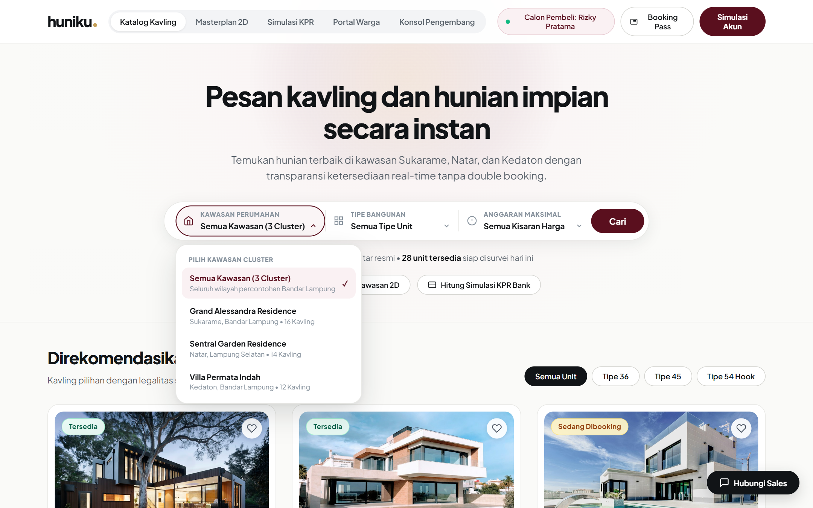

- **Tujuan Halaman:** Menyambut pengunjung dengan estetika arsitektural mewah, memperkenalkan nilai utama platform, dan menyediakan alat pencarian kavling instan.
- **Tata Letak & Hierarki Visual:**
  - **Sticky Navbar:** Latar putih bersih dengan efek `backdrop-filter: blur(12px)`, logo wordmark `huniku.` dengan dot emas, 5 tombol navigasi utama berbentuk pil, chip peran aktif pengguna (*Calon Pembeli: Rizky*), tombol akses cepat *Booking Pass*, dan tombol *Simulasi Akun*.
  - **Hero Title & Subtitle:** Judul display berani (*"Pesan kavling dan hunian impian secara instan"*) dengan tipografi Plus Jakarta Sans bobot 800, dipadukan dengan pengantar bernuansa hangat tentang keterbukaan data real-time di kawasan Sukarame, Natar, dan Kedaton.
  - **Signature Floating Search Pod:** Kapsul pencarian putih mengambang dengan 3 segmen terukur:
    1. *Kawasan Perumahan* (Ikon rumah, teks aktif, chevron rotasi).
    2. *Tipe Bangunan* (Ikon grid unit, teks aktif, chevron rotasi).
    3. *Anggaran Maksimal* (Ikon jam/anggaran, teks aktif, chevron rotasi).
    - Tombol aksi utama Velvet Maroon berlabel **Cari** di sisi kanan pod.
  - **Custom Popover Dropdown (Inovasi UX):** Menu melayang dengan sudut 20px, efek drop-shadow `0 18px 48px rgba(17,20,23,0.14)`. Menampilkan label kategori (*PILIH KAWASAN CLUSTER*), judul tebal unit (*Grand Alessandra Residence*), subteks deskriptif (*Sukarame, Bandar Lampung • 16 Kavling*), dan centang aktif maroon (`✓`).
  - **Live Indicator Strip:** Titik hijau berdenyut (*pulsing dot*) dengan status teks: *"42 kavling pilot terdaftar resmi • 28 unit tersedia siap disurvei hari ini"*.
  - **Pill Quick Actions:** Tombol pintas untuk langsung beralih ke Masterplan 2D dan Kalkulator KPR Bank.

---

### 7.2. Marketplace Catalog & Grid Kartu Properti Responsif

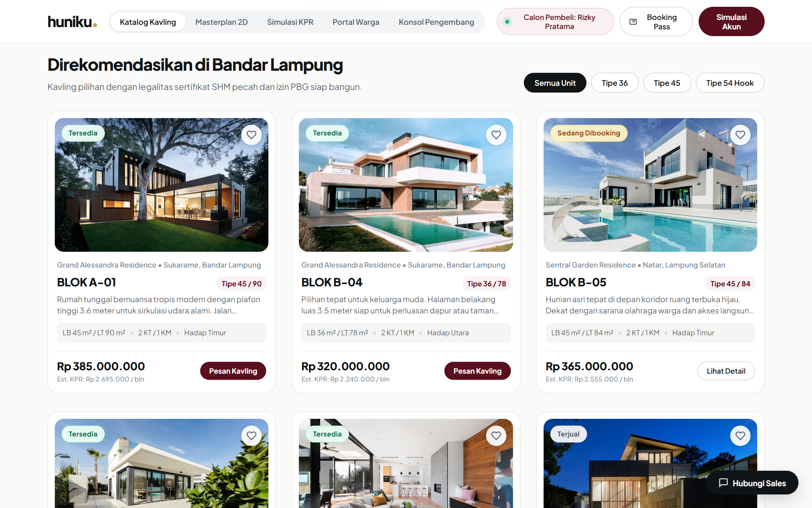

- **Tujuan Halaman:** Menyajikan katalog kavling dan hunian siap bangun dalam tata letak kartu modern yang mudah dipindai (*scannable*).
- **Tata Letak & Hierarki Visual:**
  - **Section Header & Category Filter:** Judul seksi *"Direkomendasikan di Bandar Lampung"* dengan subteks jaminan legalitas sertifikat SHM pecah dan izin PBG. Di sebelah kanan terdapat deretan chip filter kategori berbentuk kapsul (*Semua Unit*, *Tipe 36*, *Tipe 45*, *Tipe 54 Hook*).
  - **Fresha Property Cards Grid:**
    - Tata letak grid 3 kolom responsif dengan celah (*gap*) 24px.
    - Setiap kartu memiliki sudut lengkung 20px, border tipis, dan efek *hover lift* melayang halus (`translateY(-5px)`).
    - **Fasad Foto 16:10:** Foto rumah resolusi tinggi dengan radius sudut 16px.
    - **Floating Badges:** Badge ketersediaan di pojok kiri atas (Hijau soft: *Tersedia*, Amber soft: *Sedang Dibooking*, Abu: *Terjual*) dan tombol lingkaran favorit di pojok kanan atas.
    - **Informasi Unit Terstruktur:** Nama kluster perumahan, kode kavling tebal (misal `BLOK A-01`), tag tipe bangunan maroon, ringkasan spesifikasi (Luas Bangunan/Tanah, Kamar, Arah Hadap), harga resmi tebal, estimasi cicilan KPR per bulan, dan tombol aksi pil Maroon (*Lihat Detail & Pesan*).

---

### 7.3. Modal Detail Unit & Spesifikasi Arsitektural Lengkap

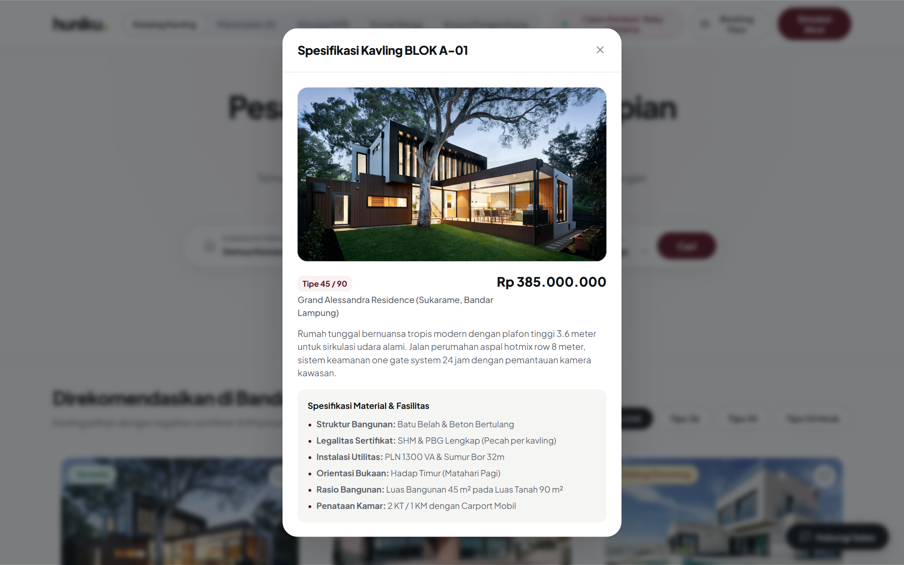

- **Tujuan Halaman:** Memberikan transparansi menyeluruh atas spesifikasi teknis bangunan, legalitas tanah, dan fasilitas sebelum pembeli melakukan pemesanan.
- **Tata Letak & Hierarki Visual:**
  - **Backdrop Overlay:** Lapisan semi-transparan gelap dengan efek blur lembut (`backdrop-filter: blur(8px)`).
  - **Modal Container:** Kotak dialog putih berlekuk 24px di tengah layar dengan tombol tutup `✕` berbingkai lingkaran di pojok kanan atas.
  - **Visual Banner:** Foto fasad unit properti proporsional dengan badge status ketersediaan.
  - **Grid Spesifikasi 6-Poin:**
    1. *Luas Bangunan & Tanah* (misal: 45 m² / 90 m²).
    2. *Kamar Tidur & Mandi* (2 KT / 1 KM).
    3. *Arah Hadap Bangunan* (Hadap Timur - Matahari Pagi).
    4. *Pondasi & Rangka* (Batu Belah & Beton Bertulang).
    5. *Instalasi Utilitas* (PLN 1300 VA & Sumur Bor 32m).
    6. *Status Legalitas* (Sertifikat SHM Pecah & PBG Lengkap).
  - **Deskripsi Arsitektur:** Penjelasan naratif keunggulan sirkulasi udara plafon tinggi 3.6m, row jalan aspal 8 meter, dan sistem gerbang *one gate system*.
  - **Footer Transaksi:** Kotak rincian harga total, estimasi cicilan per bulan, tombol konsultasi sales, dan tombol emas/maroon utama **"Pesan & Kunci Unit Ini"**.

---

### 7.4. Digital Booking Pass (Anti-Double Booking) & QR Verification

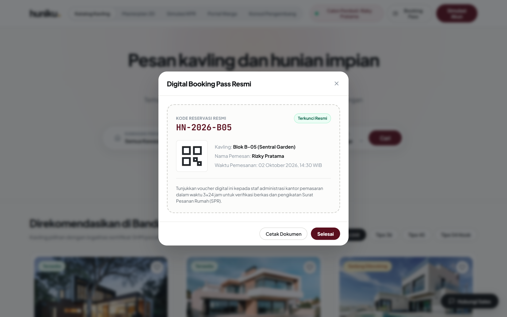

- **Tujuan Halaman:** Menerbitkan bukti sah penguncian kavling digital berformat *boarding pass* yang membuktikan kavling telah terkunci secara atomik.
- **Tata Letak & Hierarki Visual:**
  - **Header Tiket Velvet Maroon:** Logo Huniku dengan label besar *"OFFICIAL BOOKING PASS"*, kode unik transaksi tebal (misal `HN-2026-A01`), dan badge hijau terang `TERKUNCI AMAN (ANTI-DOUBLE BOOKING)`.
  - **Badan Tiket Krem Gading (Perforated Edge):**
    - Identitas Pemesan: Nama Calon Pembeli (*Rizky Pratama*), nomor kontak terverifikasi, dan stempel tanggal/waktu transaksi.
    - Kavling Terpilih: Kluster perumahan, nomor blok kavling, tipe bangunan, dan harga transaksi.
    - **QR Code Resmi:** Barcode QR digital resolusi tajam untuk pemindaian instan oleh petugas kantor pemasaran saat verifikasi fisik.
  - **Langkah Verifikasi Selanjutnya:** Panduan 3 langkah terstruktur (Kunjungan kantor pemasaran dalam 3x24 jam, membawa berkas e-KTP/KK asli, dan konsultasi bank).
  - **Aksi Tiket:** Tombol cetak/simpan tiket PDF dan tombol tutup modal.

---

### 7.5. Masterplan Kawasan 2D & Inspector Denah Interaktif

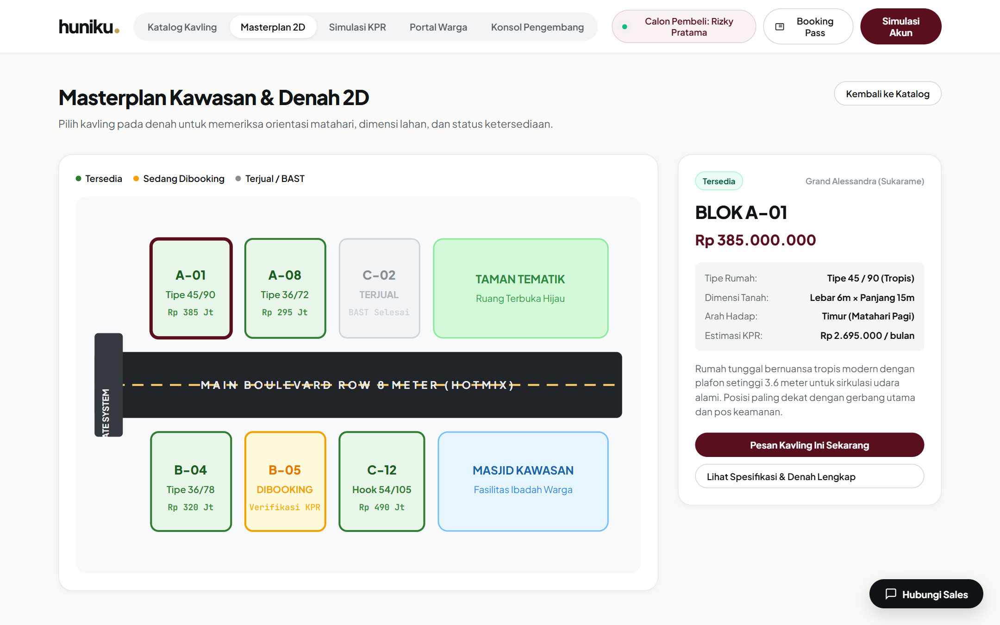

- **Tujuan Halaman:** Memberikan pemahaman spasial tata letak kavling, jalan boulevard utama, taman lingkungan, dan arah mata angin dalam format denah interaktif.
- **Tata Letak & Hierarki Visual:**
  - **Header & Filter Kluster:** Navigasi cepat untuk berpindah masterplan antara *Grand Alessandra*, *Sentral Garden*, dan *Villa Permata*.
  - **Kanvas Denah Vektor 2D:**
    - Visualisasi jalan aspal perumahan row 8 meter, gerbang masuk *one gate system*, pos keamanan, taman bermain anak, dan masjid perumahan.
    - Blok-blok kavling dengan kode warna status: Hijau (Tersedia), Kuning Emas (Sedang Dibooking), dan Abu-abu (Terjual).
    - Setiap petak kavling dapat diklik secara interaktif.
  - **Inspector Sidebar (Kanan):**
    - Kartu detail spesifikasi unit yang sedang diklik pada peta.
    - Menampilkan kode blok, luas kavling, arah hadap matahari pagi/sore, harga, serta tombol langsung menuju modal pemesanan.

---

### 7.6. Kalkulator Simulasi KPR Perbankan & Checklist Berkas

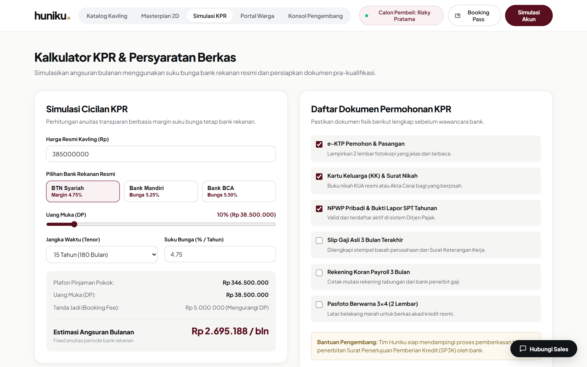

- **Tujuan Halaman:** Menyederhanakan edukasi kelayakan finansial calon pembeli rumah pertama melalui perhitungan anuitas KPR riil dari bank mitra.
- **Tata Letak & Hierarki Visual:**
  - **Bank Partner Selector:** Tiga kartu bank rekanan resmi dengan informasi suku bunga transparan:
    - *BTN Syariah* (Suku bunga 4.75% fixed 3 tahun).
    - *Bank Mandiri* (Suku bunga 5.25% fixed 5 tahun).
    - *Bank BCA* (Suku bunga 5.50% fixed 3 tahun).
  - **Slider Kontrol Interaktif:**
    - Slider Harga Properti (Rp 250 Jt – Rp 1 Miliar).
    - Slider Uang Muka / DP (10% – 50%).
    - Slider Jangka Waktu / Tenor (5 tahun – 25 tahun).
  - **Rangkuman Estimasi Finansial:** Kartu sorotan cicilan per bulan dengan angka nominal besar, rincian plafon pokok pinjaman, dan minimal penghasilan bulanan yang disarankan.
  - **Interactive Document Checklist:** Daftar centang interaktif berkas fisik yang dibutuhkan (Fotokopi KTP, KK, NPWP, Slip Gaji 3 Bulan Terakhir, Rekening Koran) yang status centangnya tersimpan secara otomatis.

---

### 7.7. Portal Layanan Warga (Huniku Resident) & Tracker Garansi 180 Hari

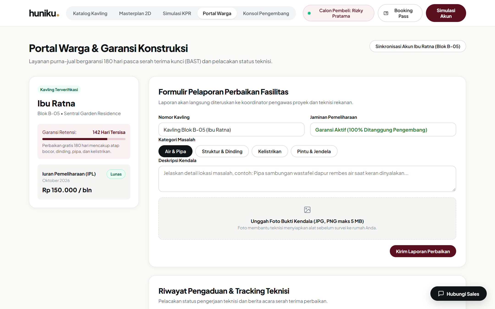

- **Tujuan Halaman:** Memberikan ekosistem layanan purna-jual menyeluruh bagi warga yang telah menempati hunian, menjamin hak komplain bebas biaya dalam masa retensi.
- **Tata Letak & Hierarki Visual:**
  - **Kartu Identitas Hunian Warga:** Menampilkan profil pemilik rumah terverifikasi (*Ibu Ratna - Blok B-05*), nama kluster, tanggal serah terima kunci, dan status hunian.
  - **Warranty Retention Tracker (180 Hari):**
    - Bar progres visual sisa hari masa garansi pemeliharaan gratis dari developer (*142 hari tersisa*).
    - Keterangan jaminan perbaikan gratis untuk kebocoran atap, dinding retak rambut, dan instalasi air/pipa.
  - **Ringkasan Tagihan IPL (Iuran Pemeliharaan Lingkungan):** Status pembayaran iuran keamanan dan kebersihan bulan berjalan (*Lunas*).
  - **Formulir Lapor Kerusakan Berfoto:**
    - Pilihan kategori aduan: *Air & Pipa*, *Bangunan Fisik*, *Kelistrikan*, *Fasilitas Umum*.
    - Area unggah foto bukti kerusakan fisik.
    - Kolom deskripsi kendala ringkas dan tombol kirim laporan.
  - **Tabel Pelacakan Status Aduan:** Riwayat tiket servis dengan status *Menunggu Review*, *Teknisi Ditugaskan*, hingga *Selesai*.

---

### 7.8. Konsol Master Pengembang (Developer & Admin Console)

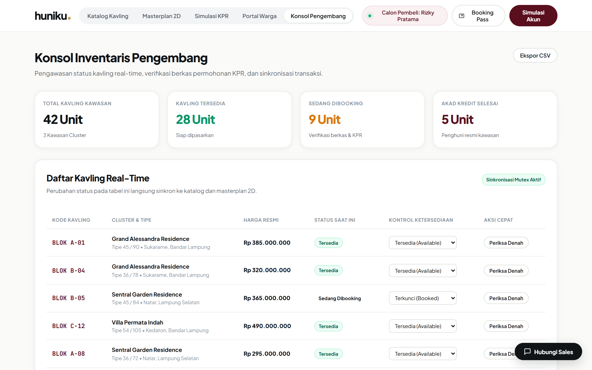

- **Tujuan Halaman:** Dashboard operasional kantor pengembang untuk memantau omset penjualan kawasan, memvalidasi berkas pembeli, dan mengelola stok kavling satu pintu.
- **Tata Letak & Hierarki Visual:**
  - **Statistik Metrik Bisnis Utama:** 4 kartu ringkasan omset:
    1. *Total Unit Kavling (42 Unit)*.
    2. *Unit Tersedia (28 Unit)*.
    3. *Unit Dibooking (6 Unit)*.
    4. *Unit Terjual / Akad (8 Unit)*.
  - **Tabel Manajemen Status Kavling Real-Time:**
    - Daftar lengkap seluruh unit perumahan lintas 3 kluster.
    - Kolom kode blok, kluster perumahan, tipe unit, harga, pemesan aktif, dan status atomik.
    - **Dropdown Kontrol Status Instan:** Admin dapat mengubah status unit (*Tersedia*, *Sedang Dibooking*, *Terjual*) secara langsung pada tabel, yang secara otomatis langsung tersinkronisasi ke katalog publik.
  - **Tab Antrean Verifikasi KPR:** Rekap data calon pembeli yang telah mengajukan simulasi dan berkas untuk jadwal wawancara bank.
  - **Tab Disposisi Teknisi:** Rekap laporan aduan warga yang siap ditugaskan ke vendor/mandor konstruksi perumahan.

---

## 8. DESIGN SYSTEM & UI TOKENS

### 8.1. Color Palette & Token Peran (Tag Warna 60:30:10)
Sistem warna Huniku Web menerapkan formula arsitektural seimbang **60:30:10**:
- **60% Dominan (Latar & Permukaan):** Warm Canvas Alabaster (`#FBF9F5`) & Pure White (`#FFFFFF`).
- **30% Struktural (Brand Identity & Teks):** Deep Velvet Maroon (`#5A0F1E` / `#3A0710`) & Charcoal Slate (`#111417`).
- **10% Aksen Emas (Konversi & Highlight):** Champagne Gold (`#D4A537` / `#C5A059`).

| Token CSS | Kode HEX | Nama Warna | Peran Desain & Implementasi | Kontras Rasio (WCAG) |
| :--- | :--- | :--- | :--- | :--- |
| `--color-maroon-dark` | `#3A0710` | Obsidian Maroon | Tombol pencarian, footer, hover tombol filter, dan background toast. | 14.2:1 terhadap `#FFF4E0` (AAA) |
| `--color-maroon-base` | `#5A0F1E` | Velvet Maroon | **Identitas Inti.** Header modal, badge brand, aksen ikon, teks aktif. | 12.4:1 terhadap `#FFF4E0` (AAA) |
| `--color-maroon-soft` | `#8B1A2B` | Rose Maroon | Border fokus form input, highlight baris tabel terpilih. | 7.6:1 terhadap `#FFF4E0` (AAA) |
| `--color-gold-base` | `#D4A537` | Champagne Gold | **Aksen Utama.** Border banner tiket pass, highlight harga, dot logo. | 8.2:1 terhadap `#3A0710` (AAA) |
| `--color-canvas` | `#FBF9F5` | Warm Alabaster | Latar belakang seluruh halaman web, mencegah silau putih murni. | 14.8:1 terhadap `#111417` (AAA) |
| `--color-surface` | `#FFFFFF` | Pure White | Permukaan kartu properti, floating search pod, panel modal. | 15.2:1 terhadap `#111417` (AAA) |
| `--color-border` | `rgba(17,20,23,0.08)`| Soft Charcoal Border| Garis tepi tipis pembatas segmen pod dan kartu katalog. | Non-text contrast 3.5:1 |
| `--color-ink-primary` | `#111417` | Ink Charcoal | Teks judul utama, harga resmi tebal, nama kluster properti. | 15.5:1 terhadap `#FBF9F5` (AAA) |
| `--color-ink-secondary`| `#4A5568` | Slate Neutral | Teks paragraf, label segmen pencarian, keterangan spesifikasi. | 7.8:1 terhadap `#FBF9F5` (AAA) |
| `--color-status-avail` | `#1E6B3E` | Emerald Green | Badge unit *Tersedia*, live inventory pulsing dot. | 6.2:1 terhadap `#EEF8F2` (AAA) |
| `--color-status-book` | `#8C6D1F` | Warm Amber | Badge unit *Sedang Dibooking*, indikator mutex lock. | 5.8:1 terhadap `#FDF8E8` (AAA) |
| `--color-status-sold` | `#5A6578` | Slate Neutral | Badge unit *Terjual*, tanda kavling sudah ditempati. | 5.4:1 terhadap `#F1F4F9` (AAA) |

### 8.2. Skala Tipografi
- **Primary Font Family:** `Plus Jakarta Sans` (Geometric Sans yang modern, bersih, dan sangat mudah dibaca pada berbagai ukuran layar).
- **Monospace Font Family:** `JetBrains Mono` (Digunakan khusus untuk kode blok kavling, voucher booking pass, dimensi angka luas tanah/bangunan).

| Tingkat (Scale) | Ukuran CSS | Bobot | Line-Height | Penerapan Elemen UI |
| :--- | :--- | :--- | :--- | :--- |
| **Hero Display H1** | 52px (`3.25rem`) | 800 (ExtraBold)| 1.15 | Judul utama seksi hero (*Pesan kavling...*) |
| **Section Title H2**| 32px (`2.00rem`) | 700 (Bold) | 1.25 | Judul seksi katalog, masterplan, dan portal |
| **Card Heading H3** | 20px (`1.25rem`) | 700 (Bold) | 1.30 | Kode kavling (*BLOK A-01*), judul kartu kluster |
| **Price Bold** | 22px (`1.38rem`) | 800 (ExtraBold)| 1.20 | Angka nominal harga unit (*Rp 385.000.000*) |
| **UI Body Large** | 16px (`1.00rem`) | 500 (Medium) | 1.50 | Deskripsi pengantar seksi dan modal detail |
| **UI Body Regular**| 14px (`0.88rem`) | 400 / 500 | 1.45 | Teks isi deskripsi unit, keterangan spesifikasi |
| **UI Label & Pill** | 13px (`0.81rem`) | 600 (SemiBold)| 1.20 | Teks tombol pil, label input, chip kategori |
| **Micro Metadata** | 11px (`0.69rem`) | 700 (Bold) | 1.20 | Kicker uppercase (*KAWASAN PERUMAHAN*, *TIPE UNIT*) |

### 8.3. Spacing & Grid System (8-Point Layout)
- **Base Unit:** 8px (Grid kelipatan 4px/8px).
- **Radius Tokens:**
  - `radius-sm`: 8px (Chip dan input field kecil).
  - `radius-md`: 12px (Tombol pil reguler, tag status).
  - `radius-lg`: 20px (Kartu properti Fresha, floating search pod).
  - `radius-xl`: 24px (Modal dialog pop-up).
  - `radius-pill`: 9999px (Tombol kapsul dan chip filter).
- **Shadow Tokens:**
  - `shadow-pod`: `0 20px 48px rgba(17, 20, 23, 0.08)` (Search pod melayang).
  - `shadow-popover`: `0 18px 48px rgba(17, 20, 23, 0.14)` (Menu dropdown popover).
  - `shadow-card`: `0 10px 30px rgba(17, 20, 23, 0.06)` (Kartu properti).

---

## 9. INTERAKSI & MIKRO-ANIMASI

Platform web Huniku dirancang dengan mikro-interaksi responsif berkecepatan 60 FPS:

1. **Custom Dropdown Pop-In Motion:**
   - Popover muncul dengan transisi gabungan *opacity* dan *scale*: `transform: translateY(8px) scale(0.97)` $\rightarrow$ `translateY(0) scale(1)`.
   - Kurva akselerasi: `cubic-bezier(0.16, 1, 0.3, 1)` dengan durasi 240ms.
2. **Rotating Chevron Indicator:**
   - Ikon panah chevron SVG memutar 180 derajat secara mulus saat segmen dropdown aktif.
3. **Pulsing Live Dot:**
   - Titik hijau pada bar status real-time berdenyut lembut menggunakan `@keyframes livePulse` dengan interval 2 detik, memberi sinyal visual bahwa sistem terhubung ke pembaruan data langsung.
4. **Card Entrance & Hover Elevation:**
   - Setiap kartu kavling muncul dengan `@keyframes cardEntrance` saat filter berganti.
   - Saat kursor diarahkan ke kartu, kartu terangkat lembut `translateY(-5px)` dengan bayangan meluas `box-shadow: 0 16px 36px rgba(17,20,23,0.12)`.
5. **Tactile Press Feedback:**
   - Tombol aksi utama, ikon favorit, dan chip filter merespons klik pengguna dengan mikro-pantulan `transform: scale(0.97)` dalam durasi 120ms.
6. **Smart Dismissal:**
   - Menu dropdown otomatis menutup saat pengguna mengeklik area luar dokumen (*click outside*) atau menekan tombol <kbd>Escape</kbd>.

---

## 10. EDGE CASES & ERROR HANDLING

1. **Konflik Pemesanan Simultan (Double Booking Race Condition):**
   - Jika dua pengguna memencet tombol *Pesan Kavling* pada unit yang sama secara bersamaan, unit terkunci oleh transaksi pertama. Transaksi kedua memunculkan notifikasi santun yang menginformasikan bahwa unit baru saja diamankan pembeli lain dan secara otomatis merekomendasikan unit serupa di blok terdekat.
2. **Pencarian Tanpa Hasil (Empty Filter State):**
   - Jika kombinasi kluster, tipe unit, dan anggaran tidak menemukan unit kavling, katalog menampilkan pesan ramah: *"Tidak ada kavling yang cocok dengan kriteria filter saat ini"* lengkap dengan tombol 1-klik *"Reset Semua Filter"*.
3. **Penyimpanan Lokal (Persistence):**
   - Status perubahan unit dari konsol pengembang disimpan di `localStorage` peramban sehingga simulasi tetap konsisten meskipun halaman di-*refresh*.

---

## 11. AKSESIBILITAS (WCAG 2.1 COMPLIANCE)

1. **Rasio Kontras Warna (WCAG AAA & AA):**
   - Teks gelap `#111417` di atas kanvas gading `#FBF9F5`: Rasio **15.5:1** (Lolos AAA).
   - Teks putih `#FFFFFF` di atas tombol Velvet Maroon `#5A0F1E`: Rasio **12.4:1** (Lolos AAA).
   - Teks maroon `#3D0A14` di atas badge Champagne Gold `#D4A537`: Rasio **8.2:1** (Lolos AAA).
2. **Navigasi Keyboard Penuh:**
   - Seluruh elemen tombol, input filter, dan modal dialog dapat diakses menggunakan tombol <kbd>Tab</kbd>, <kbd>Enter</kbd>, dan <kbd>Esc</kbd>.
3. **Semantic HTML & ARIA:**
   - Menggunakan tag HTML5 semantik (`<header>`, `<nav>`, `<main>`, `<section>`, `<footer>`).
   - Modal memiliki atribut penutup yang dapat dibaca oleh pembaca layar (*screen reader*).

---

## 12. PERILAKU RESPONSIF

- **Desktop (>= 1024px):** Layout penuh 3 kolom kartu katalog, search pod mengambang horizontal 3 segmen terintegrasi, modal dialog berpusat di tengah layar.
- **Tablet (768px – 1023px):** Search pod bertransformasi menjadi tata letak 2 baris teratur, grid katalog menjadi 2 kolom kartu, masterplan dan kalkulator beradaptasi penuh.
- **Mobile (< 768px):** Search pod bertumpuk secara vertikal yang ramah ketukan jari, grid katalog menjadi 1 kolom kartu lebar penuh, modal muncul sebagai *bottom sheet* yang nyaman dijangkau ibu jari.

---

## 13. CATATAN HANDOFF DEVELOPER

### 13.1. Struktur Repositori Web
```text
prototype-huniku-web/
├── index.html              # Berkas struktur semantik HTML5 utama
├── README.md               # Dokumentasi proyek, fitur, & petunjuk clone
├── preview.png             # Tangkapan layar antarmuka resolusi tinggi
├── .gitignore              # Konfigurasi pengabaian berkas sistem
├── css/
│   └── style.css           # Design tokens, styling Fresha pod, responsive grid, animations
├── js/
│   └── app.js              # State manager, custom popovers, atomic mutex, mortgage calc
└── assets/
    └── mockup/             # Koleksi tangkapan layar antarmuka visual resolusi tinggi
        ├── 01_hero_search_popover.png
        ├── 02_catalog_cards_grid.png
        ├── 03_modal_detail_unit.png
        ├── 04_modal_booking_pass.png
        ├── 05_masterplan_2d.png
        ├── 06_simulasi_kpr.png
        ├── 07_portal_warga.png
        └── 08_konsol_pengembang.png
```

### 13.2. Panduan Eksekusi Lokal
1. Buka terminal pada folder proyek.
2. Jalankan berkas `index.html` langsung pada browser:
   ```bash
   # Windows PowerShell
   start index.html
   ```

---

## 14. RENCANA USABILITY TESTING

### 14.1. Skenario Pengujian (Test Tasks)
1. **Task 1 (Pencarian & Filter):** "Gunakan floating search pod untuk memilih kawasan Grand Alessandra dan tipe unit Tipe 45." *(Target waktu: < 20 detik)*
2. **Task 2 (Inspeksi Spesifikasi):** "Buka modal detail unit BLOK A-01 dan periksa spesifikasi luas tanah serta arah hadap bangunan." *(Target waktu: < 30 detik)*
3. **Task 3 (Simulasi Pemesanan):** "Lakukan booking instan pada unit BLOK A-01 dan periksa apakah Digital Booking Pass terbit lengkap dengan QR Code." *(Target waktu: < 45 detik)*
4. **Task 4 (Perhitungan KPR):** "Buka menu Simulasi KPR, pilih Bank Mandiri, dan sesuaikan tenor pinjaman menjadi 15 tahun." *(Target waktu: < 30 detik)*
5. **Task 5 (Pelaporan Purna-Jual):** "Masuk ke Portal Warga dan kirimkan tiket aduan kebocoran pipa air." *(Target waktu: < 40 detik)*

### 14.2. Kuesioner System Usability Scale (SUS)
Setelah menyelesaikan 5 skenario di atas, partisipan mengisi 10 butir pertanyaan skala Likert 1–5 standar SUS. Target rata-rata skor evaluasi PjBL Semester 5 adalah **> 80.0 (Grade A / Excellent)**.

---

*Dokumen ini disusun secara resmi sebagai spesifikasi teknis dan panduan desain antarmuka (UI/UX) web platform HUNIKU.*
