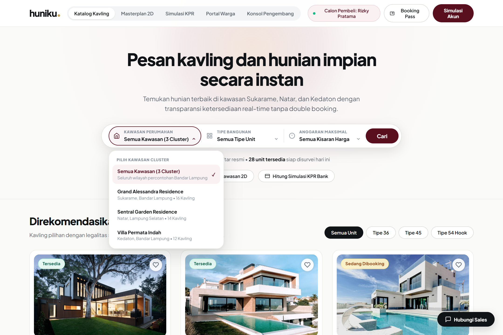

# Huniku Web Prototype 🏡✨

> **Platform Terpadu Pemesanan Kavling & Hunian Impian Secara Instan**  
> Proyek Berbasis Pembelajaran (PJBL) Semester 5 — Teknologi Rekayasa Perangkat Lunak.

[](https://keyion2478.github.io/Prototype-huniku-web/)
[](https://developer.mozilla.org/)

---

## 📸 Pratinjau Antarmuka



---

## 🌟 Fitur Utama

1. **Fresha-Style Modern Search & Filter Pod**
   - Multi-kriteria pencarian instan: *Kawasan Perumahan*, *Tipe Bangunan*, dan *Anggaran Maksimal*.
   - Custom floating popover menu berlekuk halus (`border-radius: 20px`), efek backdrop blur, dan animasi rotasi chevron SVG 180°.
   - Quick filter chip tipe unit (Semua Unit, Tipe 36, Tipe 45, Tipe 54 Hook).

2. **Katalog Kavling & Hunian Responsif**
   - Kartu unit modern dengan visualisasi foto beresolusi tinggi, status ketersediaan (*Tersedia*, *Sedang Dibooking*, *Terjual*), tag SHM, dan tombol interaktif *Simpan Favorit*.
   - Modal detail unit komprehensif lengkap dengan spesifikasi teknis (Luas Tanah, Luas Bangunan, Kamar, Daya Listrik, Air Bersih) serta alur booking instan.

3. **Masterplan 2D & Siteplan Interaktif**
   - Peta tata letak visual kawasan kavling interaktif yang memetakan ketersediaan unit secara *real-time*.

4. **Kalkulator & Simulasi KPR Perbankan**
   - Perhitungan simulasi kredit kepemilikan rumah secara deterministik berdasarkan harga unit, uang muka (DP), jangka waktu pinjaman (tenor 5–25 tahun), dan suku bunga tahunan.

5. **Portal Warga (Huniku Resident)**
   - Dashboard pasca-pembelian untuk pembayaran Iuran Pengelolaan Lingkungan (IPL), pelaporan komplain/kerusakan fasilitas, serta notifikasi keamanan & ronda warga.

6. **Konsol Pengembang (Developer Dashboard)**
   - Panel manajemen penjualan unit kavling, validasi berkas calon debitur, dan ringkasan metrik omset real-time.

---

## 🛠️ Arsitektur & Teknologi

- **Frontend**: Pure HTML5 Semantik, Vanilla CSS3 (CSS Grid, Flexbox, Keyframe Animations, Glassmorphism), dan Vanilla JavaScript (ES6+ Modules & State Management).
- **Zero Heavy Dependencies**: Sangat ringan, tidak membutuhkan proses *build* atau *node_modules* rumit, siap dijalankan langsung di peramban apa pun.
- **Tipografi**: [Plus Jakarta Sans](https://fonts.google.com/specimen/Plus+Jakarta+Sans) & [JetBrains Mono](https://fonts.google.com/specimen/JetBrains+Mono).

---

## 🚀 Menjalankan Secara Lokal

Anda tidak memerlukan server khusus untuk menjalankan prototipe ini. Cukup:

1. Kloning repositori:
   ```bash
   git clone https://github.com/Keyion2478/Prototype-huniku-web.git
   ```
2. Buka folder proyek:
   ```bash
   cd Prototype-huniku-web
   ```
3. Buka berkas `index.html` langsung di browser favorit Anda (Brave, Chrome, Edge, Firefox):
   ```bash
   # Di Windows (PowerShell):
   start index.html
   ```

---

## 📄 Lisensi & Hak Cipta

Dibuat untuk keperluan akademik **PJBL Semester 5**. Seluruh hak cipta dan merek dagang dilindungi undang-undang © 2026 Tim Pengembang Huniku.
